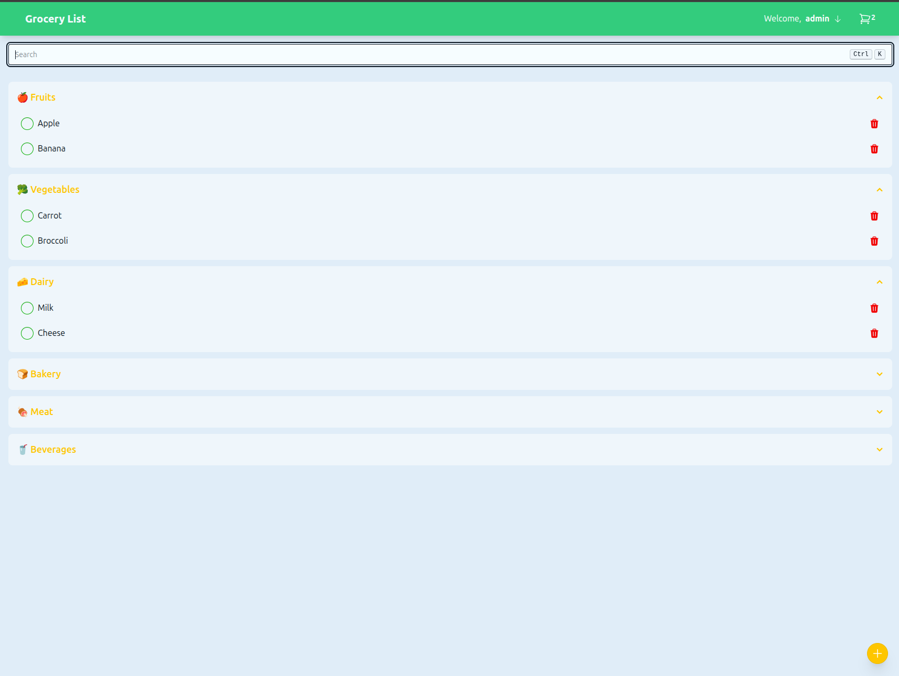
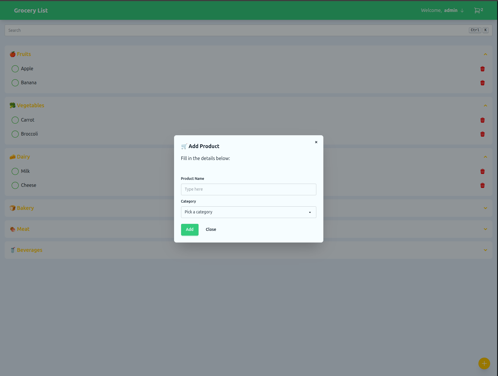
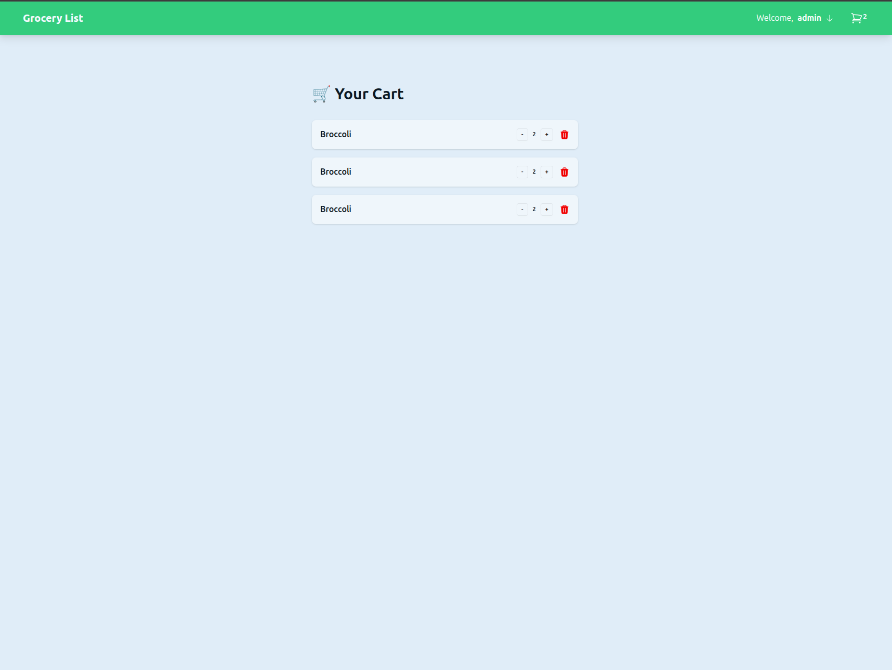

<h1 align="center">🛒 Vue Shopping List</h1>

<p align="center">
  
</p>

## Overview

Vue Shopping List is a modern shopping list application built with Laravel 12 (PHP 8.4), Inertia.js, and Vue 3. It features a clean UI, real-time updates, and a robust backend powered by Filament and Livewire. The app is designed for easy product management, category organization, and seamless cart operations.


## Features

- 🛍️ Add, edit, and remove products
- 📂 Organize products by category
- 🛒 Manage your shopping cart
- 🔍 Search products
- ⚡ Fast, reactive UI with Inertia.js and Vue 3
- 🎨 Styled with Tailwind CSS v4
- 🔒 Authentication (Sign In)
- 🧩 Modular components for easy extension

## Screenshots

<p align="center">
  
  
  
</p>

## Tech Stack

- **Backend:** Laravel 12, Filament v4, Livewire v3, Eloquent ORM
- **Frontend:** Vue 3, Inertia.js v2, Tailwind CSS v4
- **Testing:** Pest v4, PHPUnit v12
- **Dev Tools:** ESLint v9, Prettier v3, Laravel Pint v1

## Getting Started

### Prerequisites

- PHP >= 8.4
- Node.js >= 18
- Composer
- Docker (optional, for local dev)

### Installation

1. **Clone the repository:**
	```zsh
	git clone https://github.com/DanielTavares33/vue-shopping-list.git
	cd vue-shopping-list
	```
2. **Install PHP dependencies:**
	```zsh
	composer install
	```
3. **Install JS dependencies:**
	```zsh
	npm install
	```
4. **Copy and configure environment:**
	```zsh
	cp .env.example .env
	# Edit .env as needed
	```
5. **Generate app key:**
	```zsh
	php artisan key:generate
	```
6. **Run migrations and seeders:**
	```zsh
	php artisan migrate --seed
	```
7. **Build frontend assets:**
	```zsh
	npm run build
	# Or for development
	npm run dev
	```
8. **Start the server:**
	```zsh
	php artisan serve
	# Or use Docker
	docker-compose up
	```

## Usage

1. Visit [http://localhost:8000](http://localhost:8000) in your browser.
2. Sign in or register.
3. Add products, organize by category, and manage your cart.

## Project Structure

- `app/` - Laravel backend (models, controllers, resources)
- `resources/js/` - Vue components, pages, composables
- `resources/images/` - App images and screenshots
- `routes/` - Laravel routes (web, console)
- `database/` - Migrations, factories, seeders
- `public/` - Public assets

## Contributing

Pull requests are welcome! Please follow the existing code style and conventions. See the [Laravel Boost Guidelines](.github/copilot-instructions.md) for more details.

## Architecture

- **Frontoffice:** Built with Vue.js 3 for a fast, reactive user experience.
- **Backoffice:** Built with FilamentPHP v4 for a powerful admin panel.

## License

This project is open source under the [MIT License](LICENSE).

---

<p align="center">
  
</p>
